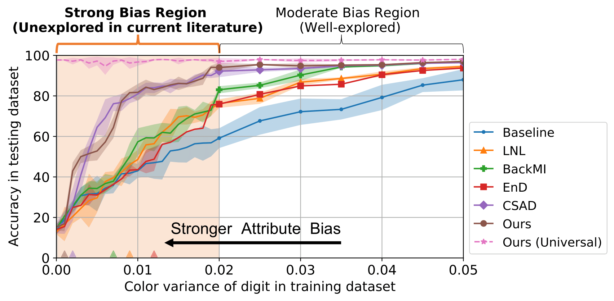

# SABAF: Removing Strong Attribute Bias from Neural Networks with Adversarial Filtering
Find our paper at [arXiv](https://arxiv.org/abs/2311.07141) and the short-version workshop paper at [arXiv](https://arxiv.org/pdf/2310.04955). Please cite the following if using the code:

Long paper:
```
@article{li2023sabaf,
  title={SABAF: Removing Strong Attribute Bias from Neural Networks with Adversarial Filtering},
  author={Li, Jiazhi and Khayatkhoei, Mahyar and Zhu, Jiageng and Xie, Hanchen and Hussein, Mohamed E and AbdAlmageed, Wael},
  journal={arXiv preprint arXiv:2311.07141},
  year={2023}
}
```
Short paper:
```
@article{li2023information,
  title={Information-Theoretic Bounds on The Removal of Attribute-Specific Bias From Neural Networks},
  author={Li, Jiazhi and Khayatkhoei, Mahyar and Zhu, Jiageng and Xie, Hanchen and Hussein, Mohamed E and AbdAlmageed, Wael},
  journal={arXiv preprint arXiv:2310.04955},
  year={2023}
}
```



## Setup
This repo uses the packages described in the `requirements.txt` file. To set the environment, simply run:
```
pip install -r requirements.txt
```

## Datasets

* [Colored MNIST dataset](https://paperswithcode.com/dataset/colored-mnist)
  * [Download](https://drive.google.com/file/d/1NSv4RCSHjcHois3dXjYw_PaLIoVlLgXu/view) or set `--color_dataset generated` to generate Colored MNIST dataset with arbitrary color variance `--biased_var BIASED_VAR`

* [CelebA dataset](http://mmlab.ie.cuhk.edu.hk/projects/CelebA.html)
  * [Download](https://drive.google.com/drive/folders/0B7EVK8r0v71pWEZsZE9oNnFzTm8?resourcekey=0-5BR16BdXnb8hVj6CNHKzLg)
  * Place images in `./data/CelebA/raw_data/img_align_celeba/*.jpg` and other files in `./data/CelebA/raw_data/`
  * Preprocess data by `python prepare_data.py --dataset CelebA`

* [Adult Income dataset](https://www.kaggle.com/datasets/kritidoneria/adultdatasetxai)
  * [Download](http://archive.ics.uci.edu/dataset/2/adult)
  * Place data in `./data/Adult/raw_data/adult.csv`
  * Preprocess data by `python prepare_data.py --dataset Adult`

* [IMDB Face dataset](https://arxiv.org/pdf/1812.10352)
  * [Download](https://data.vision.ee.ethz.ch/cvl/rrothe/imdb-wiki/static/imdb_crop.tar)
  * Place data in `./data/IMDB/raw_data/` and unzip `auxiliary.zip` into `./data/IMDB/raw_data/`
  * Preprocess data by `python prepare_data.py --dataset IMDB`

* [FFHQ dataset](https://arxiv.org/pdf/1812.04948)
  * [Download](https://github.com/NVlabs/ffhq-dataset)
  * Place data in `./data/FFHQ/raw_data/images` and labels in `./data/FFHQ/raw_data/labels`


## Custom
Besides these above-mentioned datasets, you can train and apply the adversarial filter on other datasets of interest.


### Dataset
Place data in `Custom/processed_data`. Write the methods `__len__` and `__getitem__` in `dataloader/Custom.py`, and `set_data` in `models_train/Custom_filter.py` and `models_eval/set_Custom.py`.

### Training
To train adversarial dataset on the custom dataset, simply run:
```
python train.py --experiment Custom_filter --name NAME 
```

### Apply adversarial filter
To apply adversarial filter on any downstream tasks, simply run:
```
python eval.py --experiment Custom_downstream_our --name NAME
```


## Experiments
The pre-defined experiments can be found in `run.sh`. You can either directly run these pre-defined experiments with chosen hyper-parameters to reproduce results in the paper, or train and evaluate your model.

### Training
To train adversarial filter, please use `train.py`. To see all command-line accessible arguments run:
```
python train.py --help
```

#### Colored MNIST dataset
To train adversarial filter on universal dataset, simply run:
```
python train.py --experiment CMNIST_filter --name NAME --biased_var -1 \
    --mi 10.0 --gc 100.0 --dc 100.0 --gr 100.0 
```

#### CelebA dataset
To train adversarial filter on universal dataset, simply run:
```
python train.py --experiment CelebA_filter --name NAME --CelebA_train_mode CelebA_FFHQ \
    --mi 50.0 --gc 50.0 --dc 50.0 --gr 100.0 \
    --shortcut_layers 1 --inject_layers 1 --enc_layers 5 --dec_layers 5 --dis_layers 5
```

#### Adult Income dataset
To train adversarial filter on universal dataset, simply run:
```
python train.py --experiment Adult_filter --name NAME --Adult_train_mode all \
    --mi 5.0 --gc 5.0 --dc 5.0 --gr 10.0 --epochs 100
```

#### IMDB Face dataset
To train adversarial filter on universal dataset, simply run:
```
python train.py --experiment IMDB_filter --name NAME --IMDB_train_mode all \
    --mi 50.0 --gc 50.0 --dc 50.0 --gr 100.0 \
    --shortcut_layers 1 --inject_layers 1 --enc_layers 5 --dec_layers 5 --dis_layers 5
```


### Evaluation
To evaluate adversarial filter, please use `eval.py`. To see all command-line accessible arguments run:
```
python eval.py --help
```

To load the trained filter for evaluation, you can:

either (1) use `--filter_name FILTER_NAME --filter_hp FILTER_HP --filter_idx FILTER_IDX`. For example, by indicating `--filter_name reproduce --filter_hp mi10.0_gc100.0_dc100.0_gr100.0 --filter_idx 19`, the filter which is saved as `result/reproduce/mi10.0_gc100.0_dc100.0_gr100.0/weights.19.pth` will be loaded.

or (2) use `--filter_path FILTER_PATH` to explicitly indicate the absolute path of filter.


#### Colored MNIST dataset
To reproduce the results of adversarial filter in the extreme bias point, simply run:
```
python eval.py --experiment CMNIST_downstream_our --name NAME --biased_var 0 \
    --filter_train_mode universal 
```
To reproduce the results of baseline model in the extreme bias point, simply run:
```
python eval.py --experiment CMNIST_downstream_baseline --name NAME --biased_var 0
```

#### CelebA dataset
To reproduce the results of adversarial filter in the extreme bias point, simply run:
```
python eval.py --experiment CelebA_downstream_our --name NAME --CelebA_train_mode CelebA_train_ex \
    --attributes Blond_Hair --CelebA_test_mode unbiased_ex --filter_train_mode universal
python eval.py --experiment CelebA_downstream_our --name NAME --CelebA_train_mode CelebA_train_ex \
    --attributes Blond_Hair --CelebA_test_mode conflict_ex --filter_train_mode universal
```
To reproduce the results of baseline model in the extreme bias point, simply run:
```
python eval.py --experiment CelebA_downstream_baseline --name NAME \
    --CelebA_test_mode unbiased_ex --attributes Blond_Hair
python eval.py --experiment CelebA_downstream_baseline --name NAME \
    --CelebA_test_mode conflict_ex --attributes Blond_Hair
```


#### Adult Income dataset
To reproduce the results of adversarial filter in the extreme bias point, simply run:
```
python eval.py --experiment Adult_downstream_our --name NAME \
--Adult_train_mode eb1_balanced --Adult_test_mode eb2_balanced --filter_train_mode universal
python eval.py --experiment Adult_downstream_our --name NAME \
--Adult_train_mode eb1_balanced --Adult_test_mode balanced --filter_train_mode universal
```
To reproduce the results of baseline model in the extreme bias point, simply run:
```
python eval.py --experiment Adult_downstream_baseline --name NAME \ 
--Adult_train_mode eb1_balanced --Adult_test_mode eb2_balanced 
python eval.py --experiment Adult_downstream_baseline --name NAME \ 
--Adult_train_mode eb1_balanced --Adult_test_mode balanced 
```


#### IMDB Face dataset
To reproduce the results of adversarial filter in the extreme bias point, simply run:
```
python eval.py --experiment IMDB_downstream_our --name NAME \ 
--IMDB_train_mode eb1 --IMDB_test_mode eb2 --filter_train_mode universal
python eval.py --experiment IMDB_downstream_our --name NAME \ 
--IMDB_train_mode eb1 --IMDB_test_mode unbiased --filter_train_mode universal
python eval.py --experiment IMDB_downstream_our --name NAME \ 
--IMDB_train_mode eb2 --IMDB_test_mode eb1 --filter_train_mode universal
python eval.py --experiment IMDB_downstream_our --name NAME \ 
--IMDB_train_mode eb2 --IMDB_test_mode unbiased --filter_train_mode universal
```
To reproduce the results of baseline model in the extreme bias point, simply run:
```
python eval.py --experiment IMDB_downstream_baseline --name NAME \ 
--IMDB_train_mode eb1 --IMDB_test_mode eb2
python eval.py --experiment IMDB_downstream_baseline --name NAME \ 
--IMDB_train_mode eb1 --IMDB_test_mode unbiased
python eval.py --experiment IMDB_downstream_baseline --name NAME \ 
--IMDB_train_mode eb2 --IMDB_test_mode eb1
python eval.py --experiment IMDB_downstream_baseline --name NAME \ 
--IMDB_train_mode eb2 --IMDB_test_mode unbiased
```
